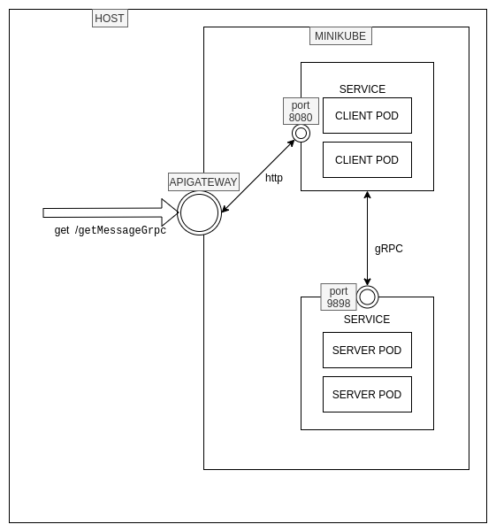

# kubernetes-playground

The objective of this project is exemplify the use of different part of microservice architecture.

## Api-gateway as entrypoint

The entrypoint of microservice architecture is [Kong](https://github.com/Kong/kubernetes-ingress-controller). Kong
unifies all requests that entry the system.

## Microservices HELLO-WORLD-CLIENT and HELLO-WORLD-SERVER

Currently, there are two microservice one client and one server. Inter-service communication is across a binary protocol
gRPC:

- [Client](hello-world-client/README.md)
- [Server](hello-world-server/README.md)

### Run microservices in local environment without docker-compose
#### Commands

```bash
## Move to hello-world-client, build docker image from Dockerfile and finally run container and send active profile as env variable
cd hello-world-client
docker build -t hello-world-client .
docker run -dit --rm --name hello-world-client --network host -p8080:8080 --env JAVA_OPTS=-Dspring.profiles.active=standalone hello-world-client

## Move to hello-world-server, build docker images from Dockerfile and finally run container
cd ../hello-world-server
docker build -t hello-world-server .
docker run -dit --rm --name hello-world-server --network host -p9898:9898 hello-world-server

## Create request to expose port
GET http://localhost:8080/message?name=ivanas93
```

### Run microservices in local environment with docker-compose
#### Commands
```bash
## Move to hello-world-client, build docker image from Dockerfile.
cd hello-world-client
docker build -t hello-world-client .

## Move to hello-world-server, build docker image from Dockerfile.
cd ../hello-world-server
docker build -t hello-world-server .

## Finally, run docker-compose
docker-compose up

## Create request to expose port
GET http://localhost:8080/message?name=ivanas93
```

### Run in Kubernetes

#### Architecture 


#### Commands
```bash
##Init kubernetes cluster (minikube)
minikube start

## Configure environment to use minikube’s Docker daemon
eval $(minikube docker-env)

## Create images inside minikube because docker images haven't been sent to remote registry
cd hello-world-client
docker build -t hello-world-client .
cd ../hello-world-server
docker build -t hello-world-server .
cd ..

## Create api-gateway service
kubectl create -f kubernetes-yml-files/service-kong-api-gateway.yml

## Create service, deployment, replica set and pods
kubectl create -f kubernetes-yml-files/service-deployment-hello-world-server.yml
kubectl create -f kubernetes-yml-files/service-deployment-hello-world-client.yml

## Add new service ingress api-gateway
kubectl create -f kubernetes-yml-files/service-ingress-kong-hello-world-client.yml

## Export IP api-gateway to variabel
export API_GATEWAY=$(minikube service -n kong kong-proxy --url | head -1)

## Request to hello-world-client ingress path
curl curl -I $API_GATEWAY/getMessageGrpc?name=ivanas93
```
